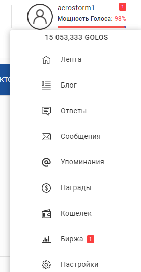
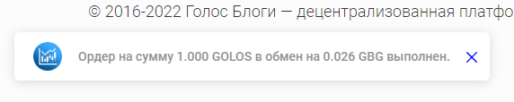
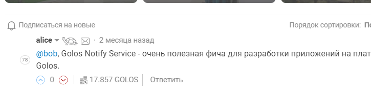
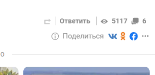

## API

В основном представлено обычным HTTP API, но для Counters существует также новое WebSocket API.

### HTTP API

Все запросы и ответы имеют формат JSON.
В случае успеха все запросы возвращают объект, содержащий поле `"status": "ok"`, а в случае ошибки - `"status": "err"`, поле `error`, содержащее текст ошибки, и HTTP-статус ошибки:
- 429 (слишком много запросов с вашего IP - более 240 (в т. ч. OPTIONS) в 1 минуту),
- 404 (неверный маршрут или метод запроса),
- 500 (внутренняя ошибка сервера),
- 400 (любые другие ошибки).

**Примечание:** Большинство запросов API требуют авторизацию аккаунтов в сервисе Golos Auth Service. Для авторизации ваш клиент (его доменное имя), использующий сервис, должен быть в белом списке сервиса. Для этого следует обратиться к сообществу.

Хранение состояния авторизации осуществляется в заголовке `X-Session` (который играет роль cookies), поэтому при каждом запросе следует сохранять в localStorage значение данного заголовка ответа (но если заголовка в ответе нет, то очищать НЕ следует), а при каждом запросе добавлять сохраненное значение к запросу.

Примеры работы с API (используя Fetch и async-await) можно найти в тестах:  
https://github.com/golos-blockchain/golosnotify/blob/dev/dataserver/cypress/support/index.js  
https://github.com/golos-blockchain/golosnotify/tree/dev/dataserver/cypress/integration

### WebSocket API

Для работы с ним требуется написать специальную обертку на основе WebSocket.  
Можно взять ее отсюда:
https://github.com/golos-blockchain/ui-blogs/blob/master/app/utils/NotifyApiClient.js  
Нужны как минимум функции `connectNotifyWs` и `notifyWsSend`.
Чтобы сделать запрос, надо вызвать `notifyWsSend(api, args, callback, eventCallback)`.
- `api` - URL запроса.
- `args` - объект с параметрами запроса.
- `callback` - если запрос возвращает ответ, то это фукнция с параметрами `(err, res)`, в случае ошибки `err != null`, в ином случае ответ лежит в `res`. Если ответ вам не нужен или запрос не возвращает его, то можно опустить `callback`.
- `eventCallback` - если запрос создает подписку на некие события, то это `{ event: 'counter', callback}`, где `event` - тип событий, `callback` - функция, которая будет вызываться каждый раз, как происходит событие, и в этой функции вы можете обрабатывать событие тем или иным образом. У запросов без подписок этот параметр опускается.

Конкретные примеры использования WebSocket даны ниже к конкретным API ([Counters API](#counters-ws-api)).

#### `POST /login_account` - авторизация аккаунта пользователя.

Для того, чтобы пользователь мог получать большинство уведомлений, ему нужно будет авторизоваться в вашем клиенте, используя для этого данный маршрут API.

POST-запрос должен иметь тело `{"account": "имя аккаунта", "authSession": "X-Auth-Session, полученный от Golos Auth Service"}`.
В ответе будут поля:
- `status` - `"ok`", если успешно авторизован, и `"err"`, если ошибка
- `error` - описание ошибки. Поле присутствует, если ошибка неверным запросом либо неполадками на самих сервисах. Если же это поле отсутствует, то пользователь не авторизован.

#### `GET /logout_account` - выход из аккаунта пользователя.

В случае, если аккаунт и не был авторизован, ошибки НЕ выдает. Возвращает ответ с полем `was_logged_in`, которое равно `true`, если аккаунт действительно был авторизован.

### Counters API

Позволяет пользователю видеть количество новых уведомлений, например сообщений Мессенджера, комментариев и т.п.



#### `GET /counters/@:account` - получение счетчика уведомлений.

Счетчики обычно отображают рядом с аватаркой пользователя, который вошел в ваш клиент, чтобы пользователь видел, что произошли какие-то события (например, кто-то написал ему сообщение) и сколько их произошло.

Вы можете делать этот запрос периодически, пока пользователь находится на странице, чтобы сразу отображать счетчик, как только случится какое-то событие. Рекомендуемая периодичность этих запросов - 1 раз при заходе на страницу и далее не чаще, чем каждые 10 секунд.

Для получения этих данных **НЕ требуется авторизация**.

#### `PUT /counters/@:account/:scopes` - прочтение уведомлений - сброс счетчика.

`scopes` - типы counters (из `/counters/@:account`) через запятую. Пример: `message`, `message,comment_reply`.

Для сброса счетчиков **требуется авторизация**, или же пользователю для прочтения уведомлений следует заходить на соответствующие страницы сервисов Golos.

### Counters WS API

Общий принцип использования WebSocket и пример кода, на основе которого нужно вызывать конкретные запросы, даны [выше](#websocket-api).

#### API: `counters`

Аналогично методу HTTP API `GET /counters/@:account`.  
Позволяет получить кол-во уведомлений, когда пользователь открывает вкладку с сайтом, или когда он только авторизовался.  
В принципе, можно также делать этот запрос по таймеру, например, каждые 10-20 секунд, чтобы получать кол-во уведомлений когда пользователь находится на сайте. Это не требует авторизации (в отличие от подписки на счетчики уведомлений), однако нивелирует все преимущества WebSocket (экономия трафика, меньше нагрузки на браузер и на сервер Golos Notify).

Параметры:
```js
{
    account: 'alice'
}
```

Для этого запроса **НЕ требуется авторизация**.

#### API: `counters/subscribe`

Подписка на счетчики уведомлений.

Параметры:
```js
{
    account: 'alice',
    'X-Session': '<сессия>'
}
```

`<сессия>` - можно получить при авторизации, через HTTP API. В дальнейшем у авторизации также может появиться WS-версия.

**callback**:  
Обычный `(err, res)`, в случае ошибки подписки - `err` содержит ошибку.

**eventCallback**:
```js
{ event: 'counter', callback: (err ,res) => {
  // будет вызываться, когда будет происходить какое-то событие, увеличивающее счетчик
  // если err == null, то res.counters - новые счетчики
  // если err != null, залогируйте err. (на данный момент этот функционал не используется. не путайте с err в callback при ошибке подписки)
}}
```

#### API: `counters/unsubscribe`

Отписка от счетчика уведомлений

Параметры:
```js
{
    account: 'alice',
    'X-Session': '<сессия>'
}
```

`<сессия>` - можно получить при авторизации, через HTTP API. В дальнейшем у авторизации также может появиться WS-версия.

#### API: `counters/read`

Отметить уведомления прочитанными. Вызывайте на соответствующей странице, например, счетчик уведомлений `donate` появляется у ссылки на страницу с историей полученных донатов, а на самой странице следует отмечать этот счетчик прочитанным.

Параметры:
```js
{
    account: 'alice',
    'X-Session': '<сессия>',
    scopes: ['donate', 'transfer']
}
```

`<сессия>` - можно получить при авторизации, через HTTP API. В дальнейшем у авторизации также может появиться WS-версия.

`scopes` - полный список [здесь](https://github.com/golos-blockchain/notify/blob/master/SCOPES.lua).

### Queues API



Каналы для мгновенных всплывающих уведомлений о личных сообщениях или других действия.

#### `GET /subscribe/@:account/:scopes` - подписка на канал.

`scopes` - `message` для личных сообщений, и другие варианты для других действий (см. счетчики).

Для этого запроса **требуется авторизация**.

После подписки следует прочитывать канал не реже, чем раз в 1 минуту, иначе канал будет автоматически отписан (удален) и потребуется снова подписываться.

#### `GET /take/@:account/:subscriber_id/:task_ids?` - получение уведомлений или личных сообщений из канала.

Метод работает по принципу long-polling: после запроса начинается ожидание ответа, пока не появятся уведомления или личные сообщения.
В случае, если уведомлений\сообщений нет и проходит некий интервал времени, запрос обрывается по тайм-ауту (может быть от 10 до 60 сек).

Если сообщения есть, то запрос надо повторить для повторного ожидания, при этом указав id-ы полученных сообщений в `task_ids` через запятую.

Для этого запроса **требуется авторизация**.

### Subs API

Подписка на новые комментарии в обсуждении (посте).



Позволяет:
- видеть красный кружочек типа **Обсуждения (3 новых)** чере Counters API
- получать список постов, на которые подписан, и кол-во новых комментариев в каждом
- подсвечивать новые комментарии в посте, и отмечать их прочитанными

В будущем планируем расширить функционал, чтобы сделать возможным подписку на любые типы "событий", в том числе на сущности вне блокчейна Golos.

#### `POST /subs/subscribe` - подписка на пост.

POST-запрос должен иметь тело `{"account": "имя аккаунта", "entity_id": "идентификатор поста типа author|permlink"}`.
В ответе будут поля:
- `status` - `"ok`", если успешно подписан, и `"err"`, если ошибка
- `added` - поля добавленной подписки в виде массива
- `deleted` - поля удаленной подписки в виде массива, если их кол-во превысило лимит и самая старая подписка была удалена (см. ниже).

Для этого запроса **требуется авторизация**.

Подписка живет неограниченное время. Но один пользователь может иметь не более **50** подписок. Если у него уже есть 50 подписок, то самая старая подписка при этом автоматически удалится.

#### `GET /subs/@:account` - список постов, на которые подписан пользователь.

Возможны дополнительные параметры:
`/subs/@lex?limit=10`
`/subs/@lex?from=10&limit=10`

Это позволяет получать не сразу весь список, а по страницам.

В ответе будут поля:
- `status` - `"ok`", если успешно, и `"err"`, если ошибка
- `result` - массив подписок, где у каждой подписки есть поля:
  - `account` - имя аккаунта;
  - `entityId` - идентификатор типа author|permlink;
  - `createsMsec` - дата подписки, UNIX timestamp в миллисекундах;
  - `eventCount` - кол-во новых комментариев с момента подписки или последнего прочтения.

#### `PATCH /subs/@:account/:entity_id` - отметить комментарии прочитанными.

`entity_id` - это идентификатор по типу author|permlink.

После выполнения запроса поле `eventCount` у данной подписки станет 0.

Для этого запроса **требуется авторизация**.

#### `GET /subs/@:account/:entity_id/events` - получить список новых комментариев в посте.

`entity_id` - это идентификатор по типу author|permlink.

В ответе будут поля:
- `status` - `"ok`", если успешно, и `"err"`, если ошибка
- `result` - массив подписок, где у каждой подписки есть поля:
  - `account` - имя аккаунта;
  - `entityId` - идентификатор типа author|permlink;
  - `data` - JSON-строка, в которой будут `author`, `permlink`, `title` и `body` комментария.

Метод можно как вызывать при открытии поста (чтобы подсветить нужные комментарии как новые), так и без открытия поста, вызвать метод для каждой из подписок, в которых есть новые комментарии, и отобразить единой лентой с текстом (`body`) каждого комментария.

#### `DELETE subs/@:account/:entity_id/unsubscribe` - отписаться от поста.

`entity_id` - это идентификатор по типу author|permlink.

После выполнения запроса поле `eventCount` у данной подписки станет 0.

В ответе будут поля:
- `status` - `"ok`", если успешно, и `"err"`, если ошибка.

Для этого запроса **требуется авторизация**.

### Views API

Позволяет отображать кол-во просмотров поста и записывать просмотры.
Если вы разработали приложение, в котором пользователи читают посты Golos, то можете добавить наш счетчик просмотров и код для записи просмотров. Ваши просмотры будут суммироваться с просмотрами от основного клиента Блогов. Либо же вы можете поднять свой собственный Golos Notify Service и тогда в нем будет своя статистика просмотров.



#### `POST /stats/view` - записать просмотр.

Метод **НЕ требует авторизации**, поскольку он записывает просмотр не аккаунтом, а IP-адресом пользователя, отправившего запрос.

Повторные просмотры с того же IP-адреса также суммирует к посту, но всего не более **5** раз.

POST-запрос должен иметь тело `{"author": "автор поста", "permlink": "пермлинк поста"}`.
В ответе будут поля:
- `status` - `"ok`", если успешно подписан, и `"err"`, если ошибка (нет такого поста, исчерпан лимит просмотров данного поста - **5** раз, или  внутренняя ошибка сервиса);
- `added` - `true`, если это первый просмотр с данного IP;
- `updated ` - `true`, если не первый, но учтен;
- `views` - кол-во просмотров поста с учетом записанного просмотра. В случае ошибки этого поля не будет.

#### `GET /stats/views/:ids` - получить кол-во просмотров поста или нескольких постов.

Метод **НЕ требует авторизации**.

`ids` - идентификаторы постов (берутся из поля `id` при запросах `getContentAsync`, `getDiscussionsByCreated` и тому подобных) через запятую.

За один запрос можно запросить от 1 до **100** постов.

В ответе будут поля:
- `status` - `"ok`", если успешно подписан, и `"err"`, если ошибка (запрошено слишком много постов или внутренняя ошибка сервиса);
- `result` - массив объектов, соответствующих запрошенным постам. В каждом объекте есть поля:
  - `views` - кол-во просмотров. Если поста не существует, то оно будет 0.
  - `updated` - дата последнего просмотра в виде UNIX timestamp milliseconds. Если поста не существует, то будет 0.

#### `POST /stats/views` - получить кол-во просмотров поста или нескольких постов.

Метод **НЕ требует авторизации**.

Аналог метода `GET /stats/views/:ids`. 

POST-запрос должен иметь тело `{"items":[176542, 6654, 7654]}`,
где `items` - массив, содержащий идентификаторы постов.
